# reactflush <a href='https://github.com/svdwoude/reactflush'></a>

[](http://www.repostatus.org/#active)
[](https://gitlab.roqs.basf.net/RawatV/reactflush/commits/master)

<br>

## Overview

[Shiny](https://github.com/rstudio/shiny)  is an R package from RStudio that makes 
it incredibly easy to build interactive web applications with R using a reactive 
programming model. The complexity of the reactive elements within a shiny application 
can quickly become complicated and difficult to keep an overview of the sources 
and endpoints of your elements. 
`reactflush` parses your code, analyses the sources and endpoints for each element
and provides a visual overview of how all the reactive elements interact wiht one
another.

This should servers as a complementary tool for [reactlog](https://github.com/rstudio/reactlog)
which provides a visual debugger for shiny reactivity. The key difference is that 
`reactflush` gives you an overview of your complete app based on your code instead
of logging the reactive activity while using the app. This ensures a complete overview
of all reactive elements in your app. This will help in identifying which elements
are reactive bottlenecks or how changing one element will affect other reactive elements.

## Features

- visualise the reactivity network of your shiny app
- focus one reactivity network around one single element in your app
- capable of identifying and processing source statements within your code
- identify all common elements: `input`, `reactive`,  `reactiveValues`, `reactiveVal`, `eventReactive`, `callModule`, `observe`, `observeEvent`, `render*`





## Installation

``` r
# install.packages("devtools")
devtools::install_github("svdwoude/reactflush")
```
## Usage

### Complete shiny app
```r
# select directory of shiny app 
dir <- fs::path(system.file("examples", package="shiny"), "07_widgets")
# create reactflush overview
reactflush(dir)
```




### Focus on one element

```r
# select directory of shiny app 
dir <- fs::path(system.file("examples", package="shiny"), "07_widgets")
# select element to focus on
element <- "output$view"
# create reactflush overview
reactflush(dir, focus = element)
```


## Rstudio Addin

### Complete shiny app


### Focus on one element


